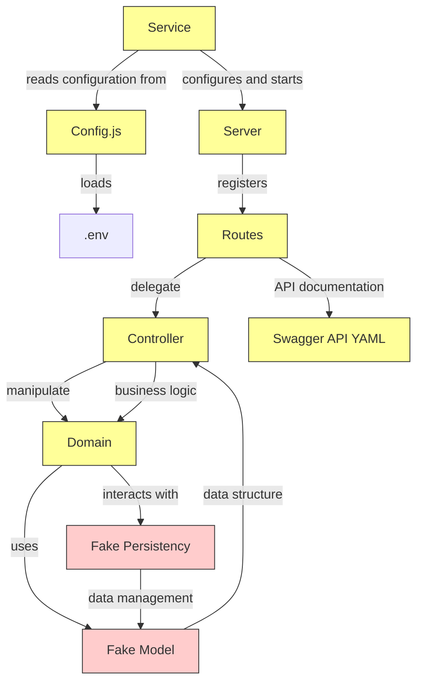

# edu-fake-microservice

> Creates a backend [fake](https://martinfowler.com/bliki/TestDouble.html) that is easy to use when working in storybook.
> The design attempts to use best practices while leaving out database and model and faking them to speed up development.
>
> When starting up two default set so data is provided in animals.js and books.js. To add more testdata, edit them.
>
> As the server is for test purposes it always starts with the same state. No data is stored persistently.



## Use

```bash
cd ws
git clone https://github.com/miwashi-edu/edu-fake-microservice.git
cd edu-fake-microservice
#If you plan to use a custom port,
echo "PORT=3001" >> .env # Code defaults to PORT=3000
npm install
npm start
```

## Adding custom CRUD domains

1. Copy for example ./src/domain/book_handler.js to ./src/domain/mushrom_handler.js
2. Edit mushrom_handler.js so that it uses mushrom fake model objekts.
3. Copy for example ./src/controller/book_controller.js to ./src/controller/mushrom_controller.js
4. Edit mushroms_controller.js so that it uses mushrom_handler.js
5. Copy for example ./src/routes/book_routes.js to ./src/routes/mushrom_routes.js
6. Edit mushrom_routes.js so it that uses mushrom_routes.js
7. Edit mushrom_routes.js so that its Swagger YAML provides a good swagger API. (Copy the code into an AI and ask it to port it to a new [domain]_routes.js)
8. Import and add, mushrom_routes in server.js.
9. Add custom images by copying them to images (Use http://localhost:PORT/list-images to copy url's for use in fake model).

## Architecture

### Service

> In this case not the service layer, but the concern of starting the micro service and setting up the environment. Name might change as it is not perfect.

### Server

> Configures the server and its routes. Also a difficult name. Application refers to usage layer, not program, and express create an object named app that would imply app.js might be better, but that confuses usage of application layer. So service is server is chosen until better name is discovered.

### Routes

> Routes concern is to configure the microservice API. It also contains YAML code for swagger as the class wasn't too busy.

### Controller

Controller is the controller in WebMVC. Its major concern is the flow of the application. It is also gatewa between http requests and model objects. Outward only http requests exists, inward no http request objects are allowed.

### Domain

> Domain is the domain knowledge. It cotains domain specific model, and domain specific functionality.

### Model

> No model is provided, it is faked in [domain]_handler.js

### Persistency

> No real persistency service is provided. It is faked in [domain]_handler.js

### Config

> Reads the environment and allows for DRY and named import of environment variables.
